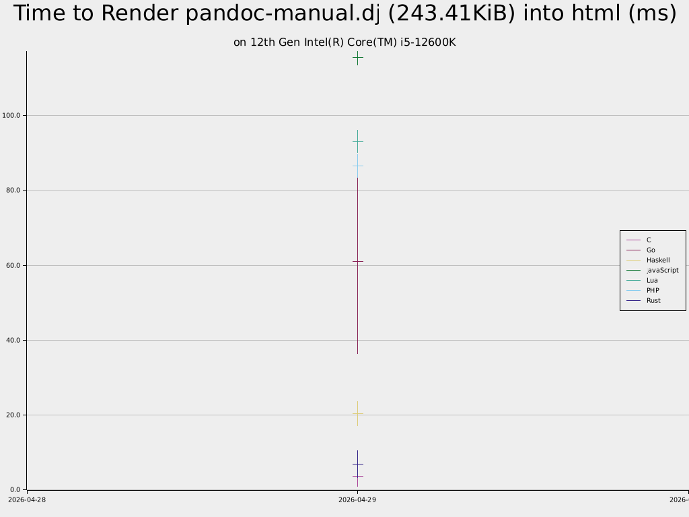
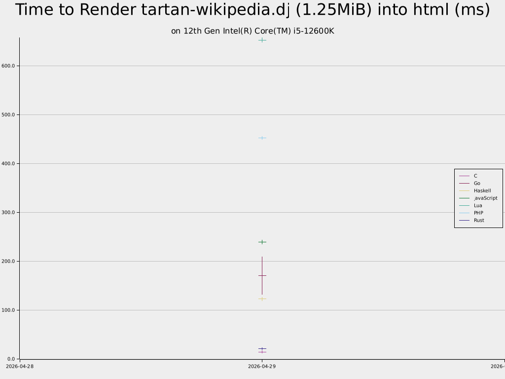

# Djot Implementations

This repository benchmarks the various Djot implementations and generates a report.

## Benchmarks

### Running on 12th Gen Intel(R) Core(TM) i5-12600K at 2026-04-29 17:11:08-04:00

Time to render pandoc-manual.dj (244K) into html:

| Command | Mean [ms] | Min [ms] | Max [ms] | Relative |
|:---|---:|---:|---:|---:|
| `C` | 3.7 ± 2.7 | 1.9 | 11.9 | 1.00 |
| `Rust` | 6.9 ± 3.6 | 3.6 | 21.0 | 1.88 ± 1.69 |
| `Haskell` | 20.4 ± 3.2 | 17.0 | 38.8 | 5.56 ± 4.16 |
| `Go` | 61.1 ± 24.7 | 25.1 | 111.1 | 16.63 ± 13.91 |
| `PHP` | 86.5 ± 3.0 | 82.1 | 92.3 | 23.56 ± 17.27 |
| `Lua` | 93.0 ± 3.0 | 88.5 | 101.7 | 25.33 ± 18.56 |
| `JavaScript` | 115.4 ± 2.0 | 112.4 | 120.1 | 31.43 ± 23.02 |
| `Prolog` | 2762.7 ± 34.7 | 2734.8 | 2846.9 | 752.34 ± 550.84 |

Time to render tartan-wikipedia.dj (1.3M) into html:

| Command | Mean [ms] | Min [ms] | Max [ms] | Relative |
|:---|---:|---:|---:|---:|
| `C` | 15.0 ± 2.3 | 11.4 | 23.3 | 1.00 |
| `Rust` | 21.5 ± 1.9 | 19.7 | 28.6 | 1.43 ± 0.25 |
| `Haskell` | 123.1 ± 3.3 | 119.7 | 132.6 | 8.20 ± 1.28 |
| `Go` | 171.0 ± 38.0 | 129.9 | 240.3 | 11.38 ± 3.08 |
| `JavaScript` | 239.7 ± 4.0 | 234.4 | 246.5 | 15.96 ± 2.47 |
| `PHP` | 452.8 ± 3.1 | 448.2 | 459.2 | 30.15 ± 4.64 |
| `Lua` | 652.8 ± 4.6 | 645.8 | 662.3 | 43.46 ± 6.69 |

### Tools

cc (GCC) 15.2.1 20260123 (Red Hat 15.2.1-7)  
C djot cdjot@9db769e  
go version go1.25.9 X:nodwarf5 linux/amd64  
Go djot godjot@v1.0.6  
The Glorious Glasgow Haskell Compilation System, version 9.8.4  
Haskell djot djot 0.1.4  
node version v22.22.0  
JavaScript djot 0.3.2  
Lua 5.4.8  
Lua djot 0.2.1  
PHP 8.4.20  
PHP djot 0.1.26  
Scryer Prolog cargo:0.10.0  
Prolog djota v0.3.4  
rustc 1.95.0 (59807616e 2026-04-14)  
