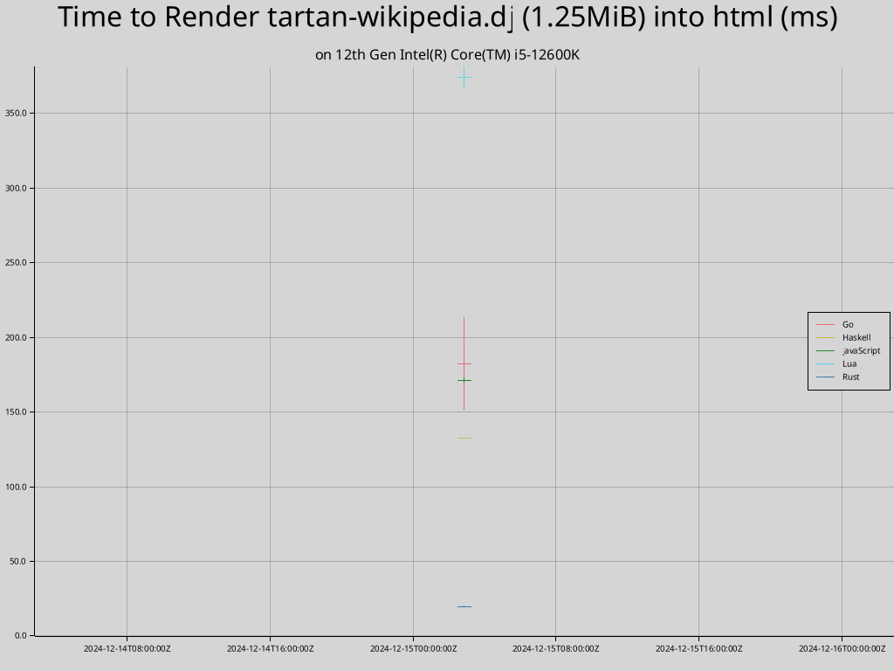

# Djot Implementations

This repository benchmarks the various Djot implementations and generates a report.

## Benchmarks

### Running on 12th Gen Intel(R) Core(TM) i5-12600K at 2024-12-09 00:41:49-05:00

Time to render pandoc-manual.dj (244K) into html:

| Command | Mean [ms] | Min [ms] | Max [ms] | Relative |
|:---|---:|---:|---:|---:|
| `Rust` | 4.4 ± 1.2 | 3.2 | 12.5 | 1.00 |
| `Haskell` | 22.7 ± 3.9 | 20.9 | 42.0 | 5.14 ± 1.69 |
| `JavaScript` | 57.1 ± 2.2 | 54.4 | 64.2 | 12.94 ± 3.65 |
| `Go` | 62.7 ± 17.2 | 22.8 | 99.5 | 14.21 ± 5.58 |
| `Lua` | 91.5 ± 1.8 | 86.5 | 95.8 | 20.75 ± 5.82 |

Time to render tartan-wikipedia.dj (1.3M) into html:

| Command | Mean [ms] | Min [ms] | Max [ms] | Relative |
|:---|---:|---:|---:|---:|
| `Rust` | 19.9 ± 0.3 | 18.8 | 20.8 | 1.00 |
| `Haskell` | 133.9 ± 3.5 | 132.4 | 142.8 | 6.73 ± 0.21 |
| `Go` | 162.1 ± 25.7 | 130.3 | 221.6 | 8.14 ± 1.30 |
| `JavaScript` | 174.6 ± 2.2 | 170.6 | 177.8 | 8.77 ± 0.18 |
| `Lua` | 665.7 ± 4.0 | 660.8 | 675.7 | 33.43 ± 0.59 |

### Running on AMD EPYC 7763 64-Core Processor at 2024-12-09 05:05:06+00:00

Time to render pandoc-manual.dj (244K) into html:

| Command | Mean [ms] | Min [ms] | Max [ms] | Relative |
|:---|---:|---:|---:|---:|
| `Rust` | 6.1 ± 0.1 | 6.0 | 8.4 | 1.00 |
| `Go` | 35.4 ± 2.5 | 31.6 | 45.7 | 5.77 ± 0.42 |
| `Haskell` | 42.4 ± 1.2 | 42.1 | 52.6 | 6.92 ± 0.25 |
| `JavaScript` | 115.0 ± 3.7 | 108.5 | 123.3 | 18.74 ± 0.71 |
| `Lua` | 148.8 ± 1.3 | 146.8 | 152.5 | 24.25 ± 0.55 |

Time to render tartan-wikipedia.dj (1.3M) into html:

| Command | Mean [ms] | Min [ms] | Max [ms] | Relative |
|:---|---:|---:|---:|---:|
| `Rust` | 34.4 ± 0.3 | 33.7 | 35.3 | 1.00 |
| `Go` | 213.1 ± 11.3 | 192.6 | 227.6 | 6.20 ± 0.33 |
| `Haskell` | 235.6 ± 0.1 | 235.4 | 235.8 | 6.86 ± 0.05 |
| `JavaScript` | 359.3 ± 4.2 | 353.8 | 365.9 | 10.46 ± 0.15 |
| `Lua` | 1124.1 ± 10.2 | 1109.9 | 1142.9 | 32.72 ± 0.39 |

### Tools

go version go1.23.3 linux/amd64  
Go djot godjot@v1.0.5  
The Glorious Glasgow Haskell Compilation System, version 9.4.8  
Haskell djot 0.1.2.2  
node version v23.3.0  
JavaScript djot 0.3.1  
Lua 5.4.4  Copyright (C) 1994-2022 Lua.org, PUC-Rio  
Lua djot 0.2.1  
rustc 1.83.0 (90b35a623 2024-11-26)  
jotdown v0.7.0
